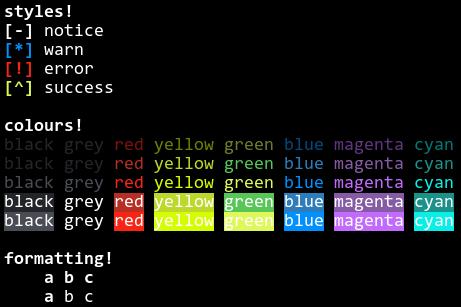

# tinge
a simple, fast, header-only library for C++ which enables pretty colours on the terminal.

> Only supports terminals which have support for ANSI escape sequences.




```cpp
#include <iostream>
// #define TINGE_PLAIN
#include <tinge.hpp>

int main() {
	// Show some styles.
	tinge::println_h("\nstyles!");
	tinge::noticeln("notice");
	tinge::warnln("warn");
	tinge::errorln("error");
	tinge::successln("success");


	// Show some colours.
	tinge::println_h("\ncolours!");

	tinge::println(
		tinge::fg::dim::black,   "black ",
		tinge::fg::dim::grey,    "grey ",
		tinge::fg::dim::red,     "red ",
		tinge::fg::dim::yellow,  "yellow ",
		tinge::fg::dim::green,   "green ",
		tinge::fg::dim::blue,    "blue ",
		tinge::fg::dim::magenta, "magenta ",
		tinge::fg::dim::cyan,    "cyan "
	);

	tinge::println(
		tinge::fg::black,   "black ",
		tinge::fg::grey,    "grey ",
		tinge::fg::red,     "red ",
		tinge::fg::yellow,  "yellow ",
		tinge::fg::green,   "green ",
		tinge::fg::blue,    "blue ",
		tinge::fg::magenta, "magenta ",
		tinge::fg::cyan,    "cyan "
	);

	tinge::println(
		tinge::fg::bright::black,   "black ",
		tinge::fg::bright::grey,    "grey ",
		tinge::fg::bright::red,     "red ",
		tinge::fg::bright::yellow,  "yellow ",
		tinge::fg::bright::green,   "green ",
		tinge::fg::bright::blue,    "blue ",
		tinge::fg::bright::magenta, "magenta ",
		tinge::fg::bright::cyan,    "cyan "
	);

	tinge::println(
		tinge::bg::black,   "black",   tinge::reset, " ",
		tinge::bg::grey,    "grey",    tinge::reset, " ",
		tinge::bg::red,     "red",     tinge::reset, " ",
		tinge::bg::yellow,  "yellow",  tinge::reset, " ",
		tinge::bg::green,   "green",   tinge::reset, " ",
		tinge::bg::blue,    "blue",    tinge::reset, " ",
		tinge::bg::magenta, "magenta", tinge::reset, " ",
		tinge::bg::cyan,    "cyan",    tinge::reset
	);

	tinge::println(
		tinge::bg::bright::black,   "black",   tinge::reset, " ",
		tinge::bg::bright::grey,    "grey",    tinge::reset, " ",
		tinge::bg::bright::red,     "red",     tinge::reset, " ",
		tinge::bg::bright::yellow,  "yellow",  tinge::reset, " ",
		tinge::bg::bright::green,   "green",   tinge::reset, " ",
		tinge::bg::bright::blue,    "blue",    tinge::reset, " ",
		tinge::bg::bright::magenta, "magenta", tinge::reset, " ",
		tinge::bg::bright::cyan,    "cyan",    tinge::reset
	);


	// Showcase some formatting.
	tinge::println_h("\nformatting!");
	tinge::println_h("\theading: ", "a ", "b ", "c");   // Whole line is bold.
	tinge::println_em("\temphasis: ", "a ", "b ", "c");  // First element is bold.

	tinge::println();


	return 0;
}
```
